

  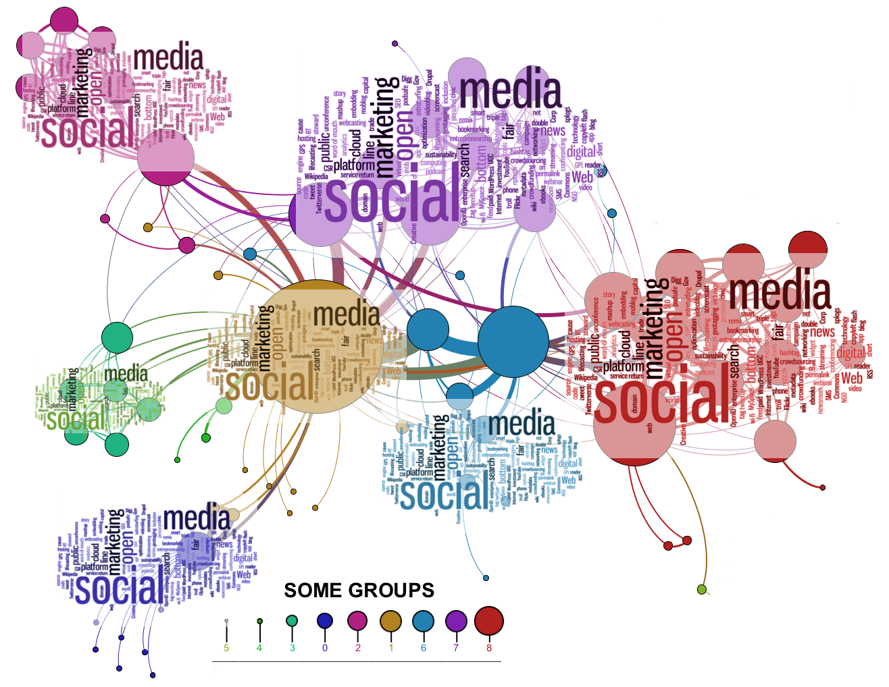

# An overview of Social Network Analysis software tools

This repository provides a quantitative analysis of a set of popular Social Networks Analysis (SNA) tools and frameworks that we hope will help software engineers, SNA researchers, and any other SNA practitioners, selecting the best and most adequate technology for their goals, and fostering new research in those dimensions where our analysis have detected that there exists room for improvement. To do a quantitative analysis, we have defined four different dimensions: *Pattern \& Knowledge discovery*, *Information Fusion \& Integration*,  *Scalability*, and *Visualization*. Using these dimensions, a set of new metrics (named *degrees*) is proposed, to later evaluate the different SNA-software tools and frameworks, providing a global overview on the current state of the art regarding SNA technologies.

The aforementioned metrics will be briefly describe in the Section [The Four Dimensions of SNA](#the-four-dimensions-of-sna). A thorough description, along with a revision of the state of the art of SNA, is available in the scientific article **”The Four Dimensions of Social Network Analysis: An Overview of Research Methods, Applications, and Software Tools”**. Nevertheless, a summary of it is available in this repository on the *paper_summary.pdf* file.

##### Table of Contents  

1. [The Four Dimensions of SNA](#the-four-dimensions-of-sna)  
2. [How to collaborate](#how-to-collaborate)
3. [TOPs 5 Tools](#top-5-tools)
4. [Software Collection](#complete-software-collection)

## The Four Dimensions of SNA

The area of SNA research generates thousand of papers per year, hundred of different algorithms, tools, and frameworks, to tackle the challenges and open issues related to Online Social Networks (OSNs). Keeping track of all theses advances is difficult for both experts and new comers. To lower this burden, we propose four new ”SNA-Dimensions”. The concept is inspired by the popular V-models used in the Big Data area, and its goal is to measure the capacity (and maturity) of the different frameworks and tools available to perform SNA tasks. These dimensions are used to define a set of metrics (that we named *degrees*), that will allow any researcher to identify the technology readiness level, and the main challenges and trends in the area of SNA. The dimensions defined will be directly related to **Pattern & Knowledge discovery**, **Information Fusion & Integration**, **Scalability**, and **Visualization** research topics.

### Pattern & Knowledge discovery

This is the most classic and studied characteristic in OSNs and is related to the *Value* dimension in the V-models. This first dimension will be used to define the capacity of knowledge discovery (mainly from a pattern mining perspective) of SNA technologies. This dimension tries to answer the question: *What can I learn?*, understood as the capacity to discover non-trivial knowledge from OSN. Its objective  is to evaluate, any type of technique, method, or tool, which is used to discover new knowledge in OSN. The main functionalities for discovering knowledge which can be embedded in SNA tools can be summarized in:

* Qualitative and quantitative/statistical analysis *(F Value(1,i))*:
  * computation of measures based on the topology *(F Value(1,1))*
  * link analysis *(F Value(1,2))*
* Pattern mining methods *(F Value(2,i))*:
  * community detection *(F Value(2,1))*
  * opinion mining *(F Value(2,2))*
  * homophily Models *(F Value(2,3)*
* Predictive analysis *(F Value(3,i))*:
  * propagation and virality modeling *(F Value(3,1))*
  * link prediction *(F Value(3,2))*.

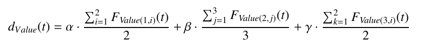

where alpha, beta and gamma are equal to 1/3.

### Scalability

This dimension will be used to define, and quantify, the scalability capacity of a tool or technique (e.g., algorithm) used in an OSN and is related to the *Volume* dimension on the V-models. A highly scalable software would work correctly on a small dataset as well as working well on a very large dataset (say millions, or billions of nodes and edges), so it will try to answer the question *“What is the limit?"*. The following sets of measures are proposed to quantify the degree of volume (dVolumne (t)), or scalability, for a SNA tool:

* Space-Time scalability *(F Volume1)*
* Parallelism scalability *(F Volume2)*
* Functional scalability *(F Volume3)*
* Heterogeneous-Integration scalability *(F Volume4)*

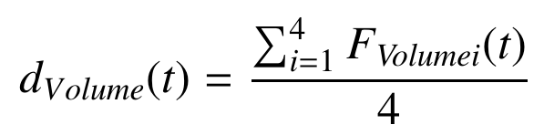

### Information Fusion & Integration

This dimension tries to answer the question: *“What kind of data can I integrate?""*. This measure would be equivalent to the concept of *Variety* on the V-models. In the case of OSN, this dimension will measure different aspects regarding the data used to perform the SNA tasks. We have defined three different measurements that will be taken into account:

* Multichannel *(F var1)*: the number of different types of data analyzed.
* Multimodality *(F var2)*: the number of different OSNs used to extract the data.
* Multi-representation *(F var3)*: the representation model used for the data.

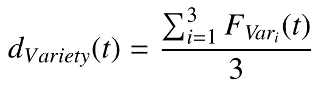

### Visualization

The concept of visualization is used as a dimension to measure the capacity of the tools, frameworks, and methods to visually represent the information stored in the network, and is related to the homonymous dimension in the V-models. Hence, this dimension will be used to answer the research question *“What can I saw?"*. We have decided to remove any aspect not related to graphics from the visualization dimension which moves away from the approaches used in the literature. Two main characteristic are used to evaluate this dimensions:

*  Visual Variables *(F VisVar)*: Different visual tools available to represent data: Position, Size, Shape, Orientation, Colour, Saturation and Texture.

* Interaction *(F Inter)*: Different actions available to change the visualization: Zoom, Filter, Highlight, Grouping, and Multiview.

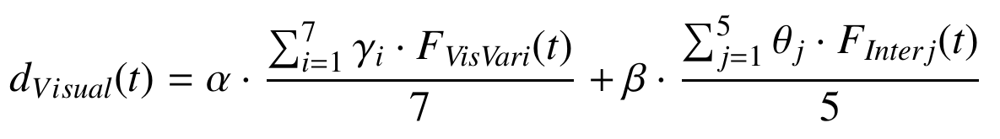

with alpha and beta equals to 1/2

### Summary table

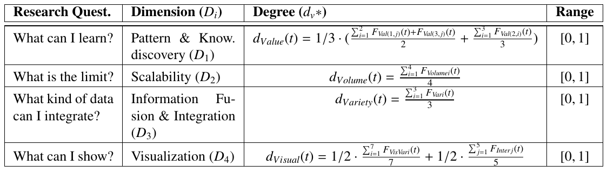

### Global metric

Finally, and considering these SNA degrees it is quite straightforward to define a new global metric, which we have called *Capability*, and represents the overall power of a tool to work with OSN sources. The Capability is calculated as the area contained in the irregular polygon defined by the 4 dimensions described in the previous sections. This general metric can be used to better understand the capability of a particular SNA technology, and can be used to provide a ranking between any SNA software considered.

The equation below defines the Capability and comes from the Shoelace formula, also known as Gauss’s area formula and the surveyor’s formula, and it is a simple formula for finding the area of a polygon given the coordinates of its vertices.

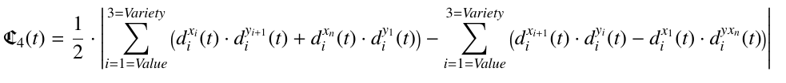

### Disclaimer

We need to make a reflection on the dimensions and metrics proposed. What is proposed here is an initial work, derived from an intense dedication to the area of social network analysis in the last ten years. These dimensions, and the defined metrics (or degrees), cannot (and should not) be considered as the only ones that can be defined, even the definition cannot be considered as complete. From the analysis of the state of the art, we have selected those more relevant (from our perspective) features that could be used to better identify and reflect the state of these technologies. It is quite probable, that some highly relevant characteristics have not been considered by authors.

For a complete description of the 4 SNA dimensions please refer to:

> To be published soon ...

## How to collaborate

We would like to encourage the community to provide its own evaluations, of both the tools that have been evaluated in this paper as well as others in which you have previous experience. This collaboration will promote the use of SNA technologies and fostering new developments, but it will not be possible without the cooperation of the community, so **your contribution will be highly appreciated**.

### Content of the repository

* **Rubric.odt** The evaluation rubric designed to assess the SNA-software tools.    
* **analized_tools.ods** Evaluations in the collection made for all the SNA-software tools so far.
* **blank_tools_template.ods** Blank template with all the candidate tools to be fill as desired.
* **analized_tools_all.ods** All the candidate tools, evaluated and not-evaluated ones.
* **README.md** the awesome page you are reading right now.
* **paper_summary.pdf** a short summary of the paper *"The Four Dimensions of Social Network Analysis: An Overview of Research Methods, Applications, and Software Tools"* where the 4 dimensions are defined.

Contributions in any of these files (including the README.md) are welcome and highly appreciated, please fill free to collaborate or contact us at *david.camacho@upm.es*

### Making a radar chart for a new tool

The *radar_chart_generator* folder contains the code necessary to generate radar charts for new tools evaluations.

### Making TOP 5 and Tools reviews

The *tools_tables_generator* folder contains the code necessary to generate the tables and tools collection review.

## TOP 5 Tools

### Understanding the analysis

The evaluation process for each software was carried out as follows: once the initial set of tools was selected, the authors agreed an evaluation rubric (Available on this repository) to assess the SNA-software. This rubric is based on the analysis of the software documentation, their official websites (or any related site that could store relevant information), and other published works that provide technical details about these tools. From this technical documentation, we assess each of the characteristics that form the different SNA degrees, to finally obtain a quantitative value for each of the proposed dimensions. The features used in this rubric (strictly) follows the characteristics proposed to measure the four dimensions, so from these features we can obtain a quantitative value for each degree.

Finally, to better compare the scores obtained in the different dimensions, the distribution of each of the dimensions is shown below.

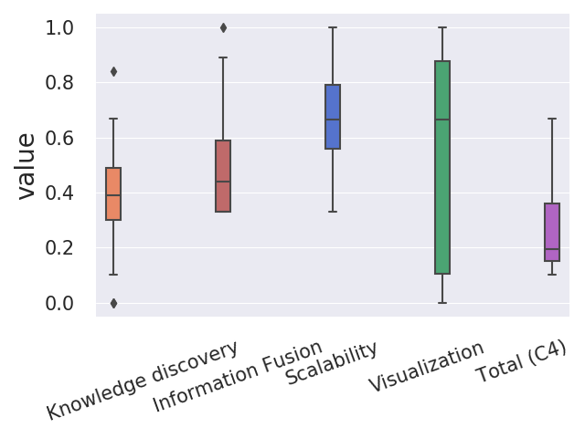

### Capability metric

|    | Tool                          |   Total (C4) |
|----|-------------------------------|--------------|
|  4 | [pygraphistry](#pygraphistry) |     0.666667 |
| 14 | [neo4j](#neo4j)               |     0.573889 |
|  3 | [ora-lite](#ora-lite)         |     0.560119 |
|  1 | [netminer](#netminer)         |     0.519853 |
|  5 | [cytoscape](#cytoscape)       |     0.394082 |

### Top Pattern and Knowledge discovery

|    | Tool                    |   Pattern and Knowledge discovery |
|----|-------------------------|-----------------------------------|
|  3 | [ora-lite](#ora-lite)   |                          0.844286 |
| 18 | [snap](#snap)           |                          0.667143 |
|  5 | [cytoscape](#cytoscape) |                          0.666667 |
|  1 | [netminer](#netminer)   |                          0.654762 |
|  8 | [networkx](#networkx)   |                          0.524286 |

### Top Information Fusion and integration

|    | Tool                                    |   Information Fusion |
|----|-----------------------------------------|----------------------|
|  4 | [pygraphistry](#pygraphistry)           |             1        |
|  1 | [netminer](#netminer)                   |             0.888889 |
|  2 | [network workbench](#network-workbench) |             0.666667 |
|  3 | [ora-lite](#ora-lite)                   |             0.666667 |
| 11 | [pajek](#pajek)                         |             0.555556 |

### Top Scalability

|    | Tool                                        |   Scalability |
|----|---------------------------------------------|---------------|
|  4 | [pygraphistry](#pygraphistry)               |      1        |
| 14 | [neo4j](#neo4j)                             |      1        |
| 12 | [allegrograph](#allegrograph)               |      1        |
| 15 | [sparkling graph](#sparkling-graph)         |      0.916667 |
| 13 | [graphx apache spark](#graphx-apache-spark) |      0.916667 |

### Top Visualization

|    | Tool                          |   Visualization |
|----|-------------------------------|-----------------|
|  3 | [ora-lite](#ora-lite)         |        1        |
|  4 | [pygraphistry](#pygraphistry) |        1        |
| 14 | [neo4j](#neo4j)               |        1        |
|  5 | [cytoscape](#cytoscape)       |        0.928571 |
|  6 | [gephi](#gephi)               |        0.928571 |

## Complete Software Collection

### UCINET

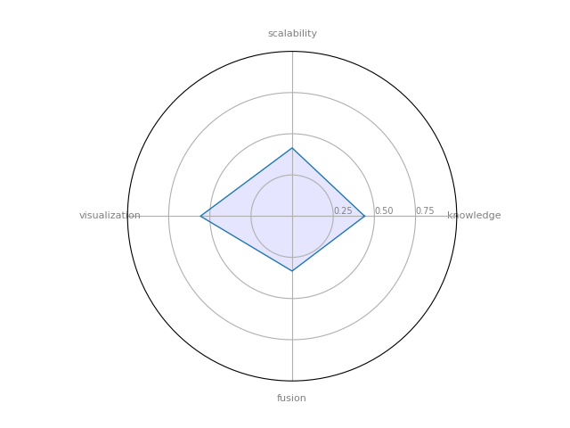

UCINET: is a software package for the analysis of social network data. It comes with the NetDraw network visualization tool.

|    | Tool                                                        |   Pattern and Knowledge discovery |   Information Fusion |   Scalability |   Visualization |   Total (C4) |
|----|-------------------------------------------------------------|-----------------------------------|----------------------|---------------|-----------------|--------------|
|  0 | [UCINET](https://sites.google.com/site/ucinetsoftware/home) |                          0.440476 |             0.333333 |      0.414167 |        0.557143 |      0.19026 |

### NetMiner

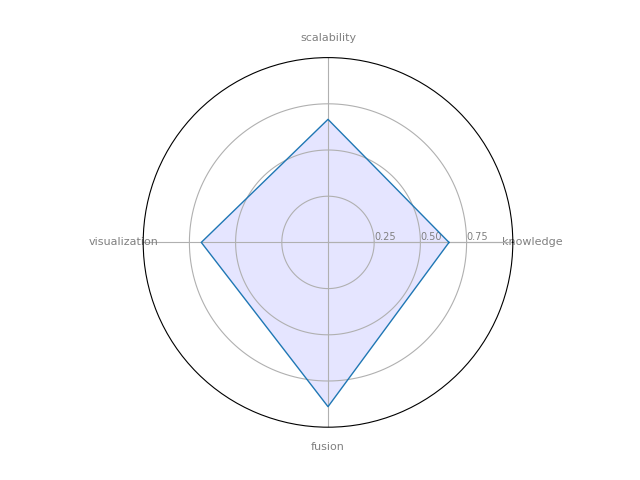

NetMiner: a premium software tool for Exploratory Analysis and Visualization of Network Data.

|    | Tool                                                  |   Pattern and Knowledge discovery |   Information Fusion |   Scalability |   Visualization |   Total (C4) |
|----|-------------------------------------------------------|-----------------------------------|----------------------|---------------|-----------------|--------------|
|  1 | [NetMiner](http://www.netminer.com/main/main-read.do) |                          0.654762 |             0.888889 |      0.665833 |        0.685714 |     0.519853 |

### Network workbench

Network workbench: A Large-Scale Network Analysis, Modeling and Visualization Toolkit for Biomedical, Social Science and Physics Research

|    | Tool                                        |   Pattern and Knowledge discovery |   Information Fusion |   Scalability |   Visualization |   Total (C4) |
|----|---------------------------------------------|-----------------------------------|----------------------|---------------|-----------------|--------------|
|  2 | [Network workbench](http://nwb.cns.iu.edu/) |                          0.332857 |             0.666667 |      0.330833 |        0.857143 |     0.252834 |

### ORA-LITE

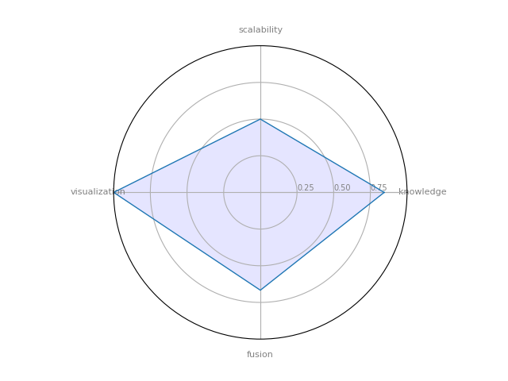

ORA-LITE: is a dynamic meta-network assessment and analysis tool. It contains hundreds of social network, dynamic network metrics, trail metrics, procedures for grouping nodes.

|    | Tool                              |   Pattern and Knowledge discovery |   Information Fusion |   Scalability |   Visualization |   Total (C4) |
|----|-----------------------------------|-----------------------------------|----------------------|---------------|-----------------|--------------|
|  3 | [ORA-LITE](http://netanomics.com) |                          0.844286 |             0.666667 |           0.5 |               1 |     0.560119 |

### PyGraphistry

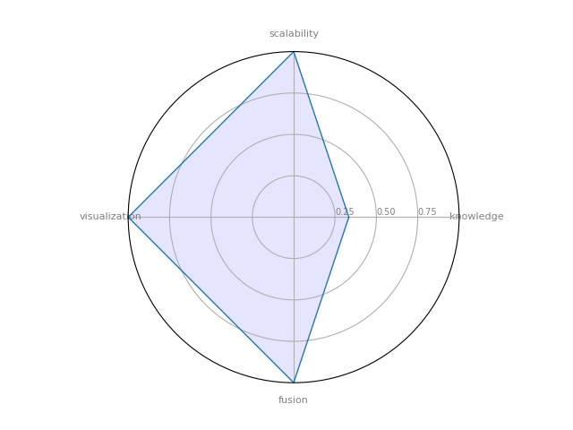

PyGraphistry is a Python visual graph analytics library to extract, transform, and load big graphs into Graphistry's visual graph analytics platform. We layout graphs with a descendant of the gorgeous ForceAtlas2 layout algorithm introduced in Gephi.

|    | Tool                                        |   Pattern and Knowledge discovery |   Information Fusion |   Scalability |   Visualization |   Total (C4) |
|----|---------------------------------------------|-----------------------------------|----------------------|---------------|-----------------|--------------|
|  4 | [PyGraphistry](https://www.graphistry.com/) |                          0.333333 |                    1 |             1 |               1 |     0.666667 |

### Cytoscape

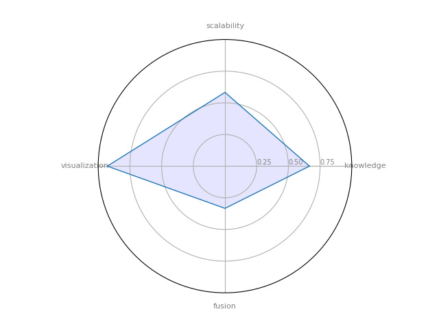

Cytoscape : a software platform for computational biology and bioinformatics, useful for integrating data, and for visualizing and performing calculations on molecular interaction networks.

|    | Tool                                |   Pattern and Knowledge discovery |   Information Fusion |   Scalability |   Visualization |   Total (C4) |
|----|-------------------------------------|-----------------------------------|----------------------|---------------|-----------------|--------------|
|  5 | [Cytoscape](https://cytoscape.org/) |                          0.666667 |             0.333333 |        0.5825 |        0.928571 |     0.394082 |

### Gephi

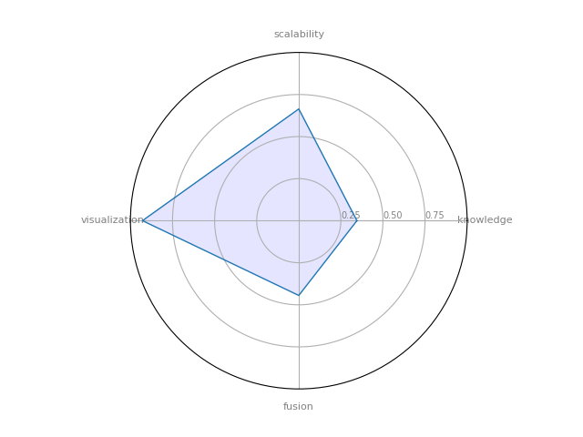

Gephi : it's a powerful open-source solution for graph visualization.

|    | Tool                        |   Pattern and Knowledge discovery |   Information Fusion |   Scalability |   Visualization |   Total (C4) |
|----|-----------------------------|-----------------------------------|----------------------|---------------|-----------------|--------------|
|  6 | [Gephi](https://gephi.org/) |                          0.345238 |             0.444444 |      0.664167 |        0.928571 |     0.346482 |

### Graphviz

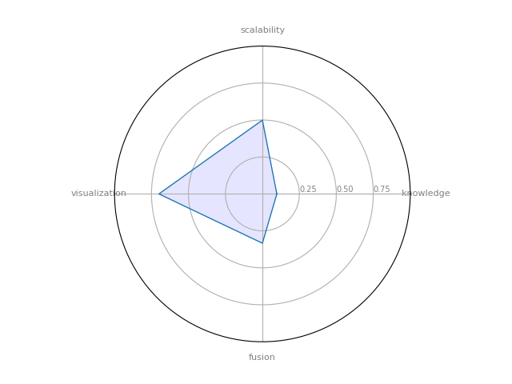

GraphViz: is open source graph visualization software.

|    | Tool                                  |   Pattern and Knowledge discovery |   Information Fusion |   Scalability |   Visualization |   Total (C4) |
|----|---------------------------------------|-----------------------------------|----------------------|---------------|-----------------|--------------|
|  7 | [Graphviz](https://www.graphviz.org/) |                          0.097619 |             0.333333 |      0.499167 |             0.7 |      0.15417 |

### NetworkX

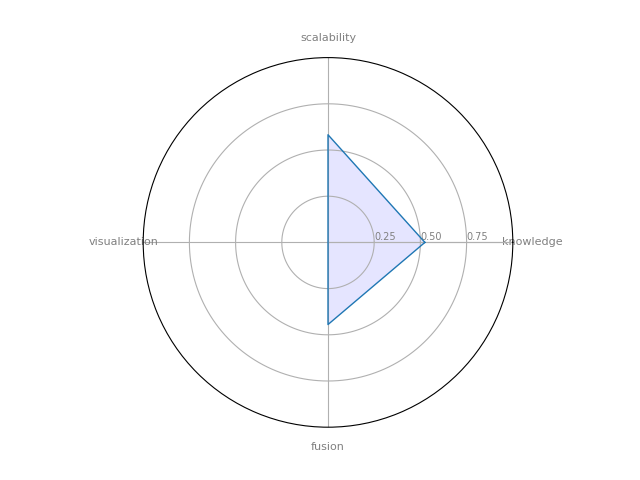

NetworkX : a Python language software package for the creation, manipulation, and study of the structure, dynamics, and functions of complex networks.

|    | Tool                                   |   Pattern and Knowledge discovery |   Information Fusion |   Scalability |   Visualization |   Total (C4) |
|----|----------------------------------------|-----------------------------------|----------------------|---------------|-----------------|--------------|
|  8 | [NetworkX](http://networkx.github.io/) |                          0.524286 |             0.444444 |        0.5825 |               0 |     0.122976 |

### Prefuse

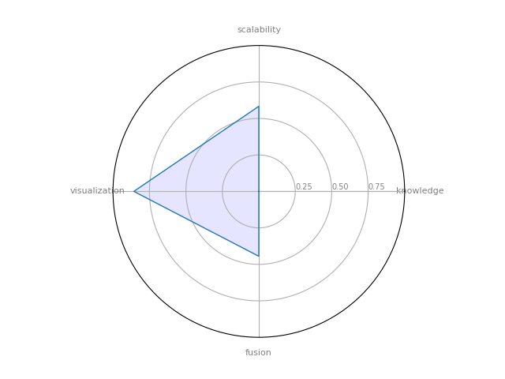

Prefuse is a Java-based toolkit for the interactive creation of information visualization applications. (not only for graphs, but also tables and trees)

|    | Tool                                             |   Pattern and Knowledge discovery |   Information Fusion |   Scalability |   Visualization |   Total (C4) |
|----|--------------------------------------------------|-----------------------------------|----------------------|---------------|-----------------|--------------|
|  9 | [Prefuse](https://es.wikipedia.org/wiki/Prefuse) |                                 0 |             0.444444 |      0.583333 |        0.857143 |     0.189815 |

### JUNG

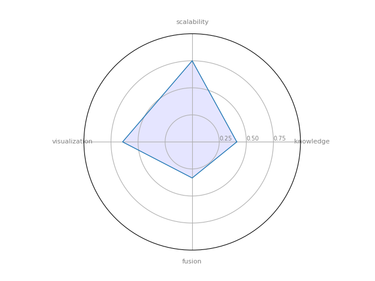

JUNG — the Java Universal Network/Graph Framework--is a software library that provides a common and extendible language for the modeling, analysis, and visualization of data that can be represented as a graph or network

|    | Tool                                 |   Pattern and Knowledge discovery |   Information Fusion |   Scalability |   Visualization |   Total (C4) |
|----|--------------------------------------|-----------------------------------|----------------------|---------------|-----------------|--------------|
| 10 | [JUNG](http://jung.sourceforge.net/) |                          0.411905 |             0.333333 |          0.75 |        0.642857 |      0.28356 |

### Pajek

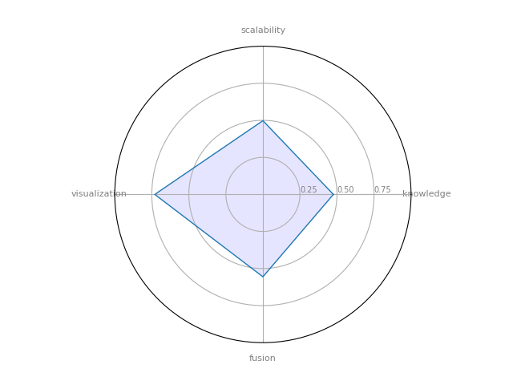

Pajek --- provide tools for analysis and visualization of such networks: collaboration networks, organic molecule in chemistry, protein receptor interaction networks, genealogies, Internet networks, citation networks, diffusion (AIDS, news, innovations) networks, data-mining (2-mode networks), etc.

|    | Tool                                       |   Pattern and Knowledge discovery |   Information Fusion |   Scalability |   Visualization |   Total (C4) |
|----|--------------------------------------------|-----------------------------------|----------------------|---------------|-----------------|--------------|
| 11 | [Pajek](http://mrvar.fdv.uni-lj.si/pajek/) |                          0.475714 |             0.555556 |        0.4975 |            0.73 |      0.31278 |

### AllegroGraph

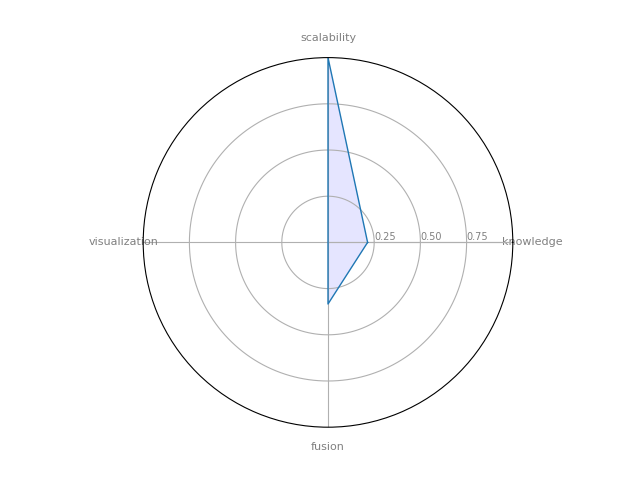

AllegroGraph  --- is an ultra scalable, high-performance, and transactional Semantic Graph Database

|    | Tool                                                   |   Pattern and Knowledge discovery |   Information Fusion |   Scalability |   Visualization |   Total (C4) |
|----|--------------------------------------------------------|-----------------------------------|----------------------|---------------|-----------------|--------------|
| 12 | [AllegroGraph](https://franz.com/agraph/allegrograph/) |                          0.214286 |             0.333333 |             1 |               0 |      0.10119 |

### GraphX Apache Spark

GraphX Apache Spark --- module to perform graph-related parallel computation.

|    | Tool                                                    |   Pattern and Knowledge discovery |   Information Fusion |   Scalability |   Visualization |   Total (C4) |
|----|---------------------------------------------------------|-----------------------------------|----------------------|---------------|-----------------|--------------|
| 13 | [GraphX Apache Spark](https://spark.apache.org/graphx/) |                              0.15 |             0.444444 |      0.916667 |               0 |     0.118519 |

### Neo4j

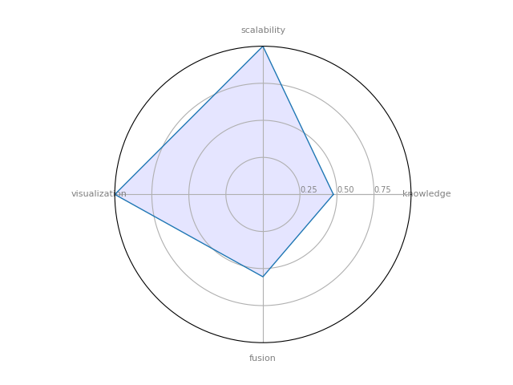

Neo4j - Open source, scalable graph database

|    | Tool                        |   Pattern and Knowledge discovery |   Information Fusion |   Scalability |   Visualization |   Total (C4) |
|----|-----------------------------|-----------------------------------|----------------------|---------------|-----------------|--------------|
| 14 | [Neo4j](https://neo4j.com/) |                          0.475714 |             0.555556 |             1 |               1 |     0.573889 |

### Sparkling Graph

SparklingGraph --- Cross-platform tool to perform large-scale, distributed network computations with Apache Spark's GraphX module

|    | Tool                                                  |   Pattern and Knowledge discovery |   Information Fusion |   Scalability |   Visualization |   Total (C4) |
|----|-------------------------------------------------------|-----------------------------------|----------------------|---------------|-----------------|--------------|
| 15 | [Sparkling Graph](https://sparkling-graph.github.io/) |                          0.404762 |             0.444444 |      0.916667 |               0 |     0.146825 |

### igraph

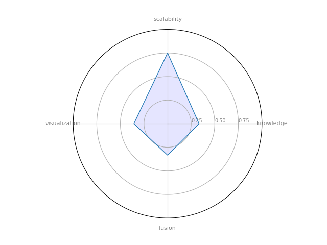

igraph --- a collection of network analysis tools with the emphasis on efficiency, portability and ease of use

|    | Tool                          |   Pattern and Knowledge discovery |   Information Fusion |   Scalability |   Visualization |   Total (C4) |
|----|-------------------------------|-----------------------------------|----------------------|---------------|-----------------|--------------|
| 16 | [igraph](https://igraph.org/) |                          0.333333 |             0.333333 |          0.75 |        0.357143 |     0.187004 |

### Circulo

Circulo --- a "Community Detection" Evaluation Framework written primarily in Python

|    | Tool                                       |   Pattern and Knowledge discovery |   Information Fusion |   Scalability |   Visualization |   Total (C4) |
|----|--------------------------------------------|-----------------------------------|----------------------|---------------|-----------------|--------------|
| 17 | [Circulo](http://lab41.github.io/Circulo/) |                          0.380952 |             0.333333 |          0.75 |        0.357143 |     0.195224 |

### SNAP

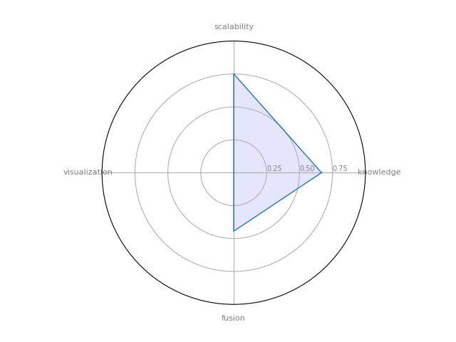

Stanford Network Analysis Platform (SNAP) --- a general purpose, high performance system for analysis and manipulation of large networks

|    | Tool                                             |   Pattern and Knowledge discovery |   Information Fusion |   Scalability |   Visualization |   Total (C4) |
|----|--------------------------------------------------|-----------------------------------|----------------------|---------------|-----------------|--------------|
| 18 | [SNAP](http://snap.stanford.edu/snap/index.html) |                          0.667143 |             0.444444 |      0.750833 |               0 |     0.157553 |

### GUESS

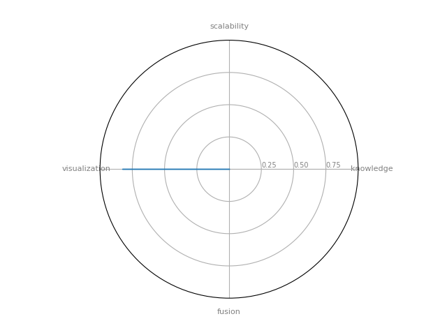

GUESS is an exploratory data analysis and visualization tool for graphs and networks. The system contains a domain-specific embedded language called Gython (an extension of Python, or more specifically Jython) which supports the operators and syntactic sugar necessary for working on graph structures in an intuitive manner.

|    | Tool                                       |   Pattern and Knowledge discovery |   Information Fusion |   Scalability |   Visualization |   Total (C4) |
|----|--------------------------------------------|-----------------------------------|----------------------|---------------|-----------------|--------------|
| 19 | [GUESS](http://graphexploration.cond.org/) |                                 0 |                    0 |             0 |        0.828571 |            0 |
