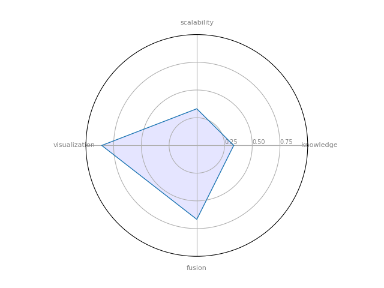
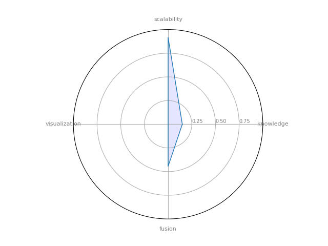
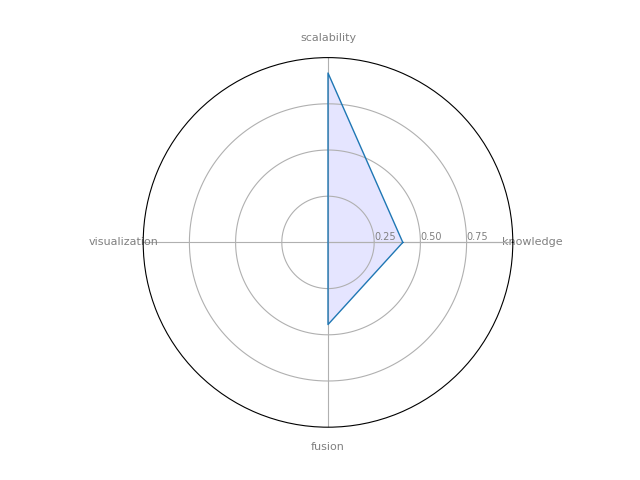

  

## SNA software tools

A collection of detailed quantitative analyses on SNA frameworks and tools. The aim of this collection is to help newcomers selecting the most adequate technology for their goals and fostering new research in those dimensions where exists room for improvement.

##### Table of Contents  

1. [The Four Dimensions of SNA](#the-four-dimensions-of-sna)  
2. [How to collaborate](#how-to-collaborate)
3. [TOPs 5 Tools](#top-5-tools)
4. [Software Collection](#software-collection)

## The Four Dimensions of SNA

In order to do a quantitative assessment of the tools four dimension have been defined: **Pattern and Knowledge discovery**, **Information Fusion and integration**, **Scalability**, and **Visualization**.

* **What can I discover?** This question is related to the different types of knowledge that the tool is able to extract. The goal of this question is to quantify the capacity of the tool to extract valuable knowledge from the data. To answer this question, the dimension *Pattern and Knowledge discovery* has been considered.

* **What is the limit?** Answering this question the community will understand the scalability of the tool. This question is quite important due to the amount of data that can be extracted from social networks. This question has been addressed through the *Scalability* dimension.

* **What kind of data can I integrate?** This relevant question, related to the capacity to integrate and fusion information from current SNA technologies, has been analysed through the *Information Fusion and Integration* dimension.

* **What can I show?** Finally, this last question was explored using the *Visualization* dimension, although there exist a large number of information visualization, and tools that provide flexible methods to visualize the information, this is still an open problem in the area.

For a complete description of the 4 dimension please refer to:

> To be published soon ...

### Disclaimer

We need to make a reflection on the dimensions and metrics proposed. What is proposed here is an initial work, derived from an intense dedication to the area of social network analysis in the last ten years. These dimensions, and the defined metrics (or degrees), cannot (and should not) be considered as the only ones that can be defined, even the definition cannot be considered as complete. From the analysis of the state of the art, we have selected those more relevant (from our perspective) features that could be used to better identify and reflect the state of these technologies. It is quite probable, that some highly relevant characteristics have not been considered by authors.

## How to collaborate

We would like to encourage the community to provide its own evaluations, of both the tools that have been evaluated in this paper as well as others in which you have previous experience. This collaboration will promote the use of SNA technologies and fostering new developments, but it will not be possible without the cooperation of the community, so **your contribution will be highly appreciated**.

### Content of the repository

* **Rubric.odt** The evaluation rubric designed to assess the SNA-software tools.    
* **analized_tools.ods** Evaluations in the collection made for all the SNA-software tools so far.
* **blank_tools_template.ods** Blank template with all the candidate tools to be fill as desired.
* **analized_tools_all.ods** All the candidate tools, evaluated and not-evaluated ones.
* **README.md** the awesome page you are reading right now.

Contributions in any of these files (including the README.md) are welcome and highly appreciated, please fill free to collaborate or contact us at *david.camacho@upm.es*

### Making a radar chart for a new tool

The *radar_chart_generator* folder contains the code necessary to generate radar charts for new tools evaluations.

## TOP 5 Tools

### Total(C4) metric

|    | Tool                                                  |   Total (C4) |
|----|-------------------------------------------------------|--------------|
|  4 | [PyGraphistry](https://www.graphistry.com/)           |     0.666667 |
| 14 | [Neo4j](https://neo4j.com/)                           |     0.573889 |
|  3 | [ORA-LITE](http://netanomics.com)                     |     0.560119 |
|  1 | [NetMiner](http://www.netminer.com/main/main-read.do) |     0.519853 |
|  5 | [Cytoscape](https://cytoscape.org/)                   |     0.394082 |

### Top Pattern and Knowledge discovery

|    | Tool                                                  |   Pattern and Knowledge discovery |
|----|-------------------------------------------------------|-----------------------------------|
|  3 | [ORA-LITE](http://netanomics.com)                     |                          0.844286 |
| 18 | [SNAP](http://snap.stanford.edu/snap/index.html)      |                          0.667143 |
|  5 | [Cytoscape](https://cytoscape.org/)                   |                          0.666667 |
|  1 | [NetMiner](http://www.netminer.com/main/main-read.do) |                          0.654762 |
|  8 | [NetworkX](http://networkx.github.io/)                |                          0.524286 |

### Top Information Fusion and integration

|    | Tool                                                  |   Information Fusion |
|----|-------------------------------------------------------|----------------------|
|  4 | [PyGraphistry](https://www.graphistry.com/)           |             1        |
|  1 | [NetMiner](http://www.netminer.com/main/main-read.do) |             0.888889 |
|  2 | [Network workbench](http://nwb.cns.iu.edu/)           |             0.666667 |
|  3 | [ORA-LITE](http://netanomics.com)                     |             0.666667 |
| 11 | [Pajek](http://mrvar.fdv.uni-lj.si/pajek/)            |             0.555556 |

### Top Scalability

|    | Tool                                                    |   Scalability |
|----|---------------------------------------------------------|---------------|
|  4 | [PyGraphistry](https://www.graphistry.com/)             |      1        |
| 14 | [Neo4j](https://neo4j.com/)                             |      1        |
| 12 | [AllegroGraph](https://franz.com/agraph/allegrograph/)  |      1        |
| 15 | [Sparkling Graph](https://sparkling-graph.github.io/)   |      0.916667 |
| 13 | [GraphX Apache Spark](https://spark.apache.org/graphx/) |      0.916667 |

### Top Visualization

|    | Tool                                        |   Visualization |
|----|---------------------------------------------|-----------------|
|  3 | [ORA-LITE](http://netanomics.com)           |        1        |
|  4 | [PyGraphistry](https://www.graphistry.com/) |        1        |
| 14 | [Neo4j](https://neo4j.com/)                 |        1        |
|  5 | [Cytoscape](https://cytoscape.org/)         |        0.928571 |
|  6 | [Gephi](https://gephi.org/)                 |        0.928571 |

## Complete Software Collection

|    | Tool                                                                                                                                                                                                                                                                                                                                                                           |   Pattern and Knowledge discovery |   Information Fusion |   Scalability |   Visualization |   Total (C4) | Chart                                                  |
|----|--------------------------------------------------------------------------------------------------------------------------------------------------------------------------------------------------------------------------------------------------------------------------------------------------------------------------------------------------------------------------------|-----------------------------------|----------------------|---------------|-----------------|--------------|--------------------------------------------------------|
|  0 | [UCINET](https://sites.google.com/site/ucinetsoftware/home)UCINET: is a software package for the analysis of social network data. t comes with the NetDraw network visualization tool.                                                                                                                                                                                         |                          0.440476 |             0.333333 |      0.414167 |        0.557143 |     0.19026  |                            |
|  1 | [NetMiner](http://www.netminer.com/main/main-read.do)NetMiner: an premium software tool for Exploratory Analysis and Visualization of Network Data.                                                                                                                                                                                                                            |                          0.654762 |             0.888889 |      0.665833 |        0.685714 |     0.519853 |                        |
|  2 | [Network workbench](http://nwb.cns.iu.edu/)Network workbench: Network Workbench: A Large-Scale Network Analysis, Modeling and Visualization Toolkit for Biomedical, Social Science and Physics Research                                                                                                                                                                        |                          0.332857 |             0.666667 |      0.330833 |        0.857143 |     0.252834 |      |
|  3 | [ORA-LITE](http://netanomics.com)ORA-LITE: is a dynamic meta-network assessment and analysis tool. It contains hundreds of social network, dynamic network metrics, trail metrics, procedures for grouping nodes.                                                                                                                                                              |                          0.844286 |             0.666667 |      0.5      |        1        |     0.560119 |                        |
|  4 | [PyGraphistry](https://www.graphistry.com/)PyGraphistry is a Python visual graph analytics library to extract, transform, and load big graphs into Graphistry's visual graph analytics platform. We layout graphs with a descendant of the gorgeous ForceAtlas2 layout algorithm introduced in Gephi. parce que corre en GPUs en su servidor.                                  |                          0.333333 |             1        |      1        |        1        |     0.666667 |                |
|  5 | [Cytoscape](https://cytoscape.org/)Cytoscape : a software platform for computational biology and bioinformatics, useful for integrating data, and for visualizing and performing calculations on molecular interaction networks.                                                                                                                                               |                          0.666667 |             0.333333 |      0.5825   |        0.928571 |     0.394082 |                      |
|  6 | [Gephi](https://gephi.org/)Gephi : it's a powerful open-source solution for graph visualization. The larger datasets tend to have a hair-ball look and are hard to understand via Gephi. (300000 y 1000000 edges)                                                                                                                                                              |                          0.345238 |             0.444444 |      0.664167 |        0.928571 |     0.346482 |                              |
|  7 | [Graphviz](https://www.graphviz.org/)GraphViz: is open source graph visualization software.                                                                                                                                                                                                                                                                                    |                          0.097619 |             0.333333 |      0.499167 |        0.7      |     0.15417  |                        |
|  8 | [NetworkX](http://networkx.github.io/)NetworkX : a Python language software package for the creation, manipulation, and study of the structure, dynamics, and functions of complex networks.                                                                                                                                                                                   |                          0.524286 |             0.444444 |      0.5825   |        0        |     0.122976 |                        |
|  9 | [Prefuse](https://es.wikipedia.org/wiki/Prefuse)Prefuse es un toolkit basado en Java para la creación interactiva de aplicaciones de visualización de la información. (no solo para grafos, también tablas y árboles)                                                                                                                                                          |                          0        |             0.444444 |      0.583333 |        0.857143 |     0.189815 |                          |
| 10 | [JUNG](http://jung.sourceforge.net/)JUNG — the Java Universal Network/Graph Framework--is a software library that provides a common and extendible language for the modeling, analysis, and visualization of data that can be represented as a graph or network                                                                                                                |                          0.411905 |             0.333333 |      0.75     |        0.642857 |     0.28356  |                                |
| 11 | [Pajek](http://mrvar.fdv.uni-lj.si/pajek/)Pajek --- provide tools for analysis and visualization of such networks: collaboration networks, organic molecule in chemistry, protein receptor interaction networks, genealogies, Internet networks, citation networks, diffusion (AIDS, news, innovations) networks, data-mining (2-mode networks), etc.                          |                          0.475714 |             0.555556 |      0.4975   |        0.73     |     0.31278  |                              |
| 12 | [AllegroGraph](https://franz.com/agraph/allegrograph/)AllegroGraph  --- is an ultra scalable, high-performance, and transactional Semantic Graph Database                                                                                                                                                                                                                      |                          0.214286 |             0.333333 |      1        |        0        |     0.10119  |                |
| 13 | [GraphX Apache Spark](https://spark.apache.org/graphx/)GraphX Apache Spark --- module to perform graph-related parallel computation.                                                                                                                                                                                                                                           |                          0.15     |             0.444444 |      0.916667 |        0        |     0.118519 |  |
| 14 | [Neo4j](https://neo4j.com/)Neo4j - Open source, scalable graph database                                                                                                                                                                                                                                                                                                        |                          0.475714 |             0.555556 |      1        |        1        |     0.573889 |                              |
| 15 | [Sparkling Graph](https://sparkling-graph.github.io/)SparklingGraph --- Cross-platform tool to perform large-scale, distributed network computations with Apache Spark's GraphX module                                                                                                                                                                                         |                          0.404762 |             0.444444 |      0.916667 |        0        |     0.146825 |          |
| 16 | [igraph](https://igraph.org/)igraph --- a collection of network analysis tools with the emphasis on efficiency, portability and ease of use                                                                                                                                                                                                                                    |                          0.333333 |             0.333333 |      0.75     |        0.357143 |     0.187004 |                            |
| 17 | [Circulo](http://lab41.github.io/Circulo/)Circulo --- a "Community Detection" Evaluation Framework written primarily in Python                                                                                                                                                                                                                                                 |                          0.380952 |             0.333333 |      0.75     |        0.357143 |     0.195224 |                          |
| 18 | [SNAP](http://snap.stanford.edu/snap/index.html)Stanford Network Analysis Platform (SNAP) --- a general purpose, high performance system for analysis and manipulation of large networks                                                                                                                                                                                       |                          0.667143 |             0.444444 |      0.750833 |        0        |     0.157553 |                                |
| 19 | [GUESS](http://graphexploration.cond.org/)GUESS is an exploratory data analysis and visualization tool for graphs and networks. The system contains a domain-specific embedded language called Gython (an extension of Python, or more specifically Jython) which supports the operators and syntactic sugar necessary for working on graph structures in an intuitive manner. |                          0        |             0        |      0        |        0.828571 |     0        |                              |
